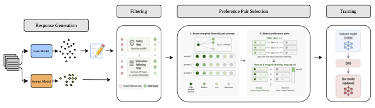

# RECAPO: Recovering Coverage with Preference Optimization

This repository contains the code and data pipeline for "RECAPO: Recovering Coverage with Preference Optimization" [UNDER REVIEW].



---

## Installation

```bash
git clone <repo-url>
cd <repo-name>
pip install -r requirements.txt
```

> **Note:** The IFEval dependency requires a vendored `lm-evaluation-harness` submodule under `evals/`. Make sure to install from the repo root as shown above so the `-e ./evals/lm-evaluation-harness[ifeval]` path resolves correctly.

After installing, download the spaCy English model:
```bash
python -m spacy download en_core_web_sm
```

---

## Setup

Fill in your API keys in `env.sh`, then source it before running any script:

```bash
# env.sh
export HF_TOKEN="your_huggingface_token"
export OPENAI_API_KEY="your_openai_key"
export WANDB_API_KEY="your_wandb_key"
```

```bash
source env.sh
```

---

## Data Creation Pipeline

The pipeline takes a prompt dataset, generates diverse responses, filters and embeds them, scores diversity, and selects preference pairs for DPO training.

### Option A: Run the full pipeline in one script

For Qwen models (recommended starting point):
```bash
bash scripts/end_to_end_subset.sh
```

For OLMo models:
```bash
bash scripts/unity_end_to_end.sh
```

### Option B: Run each stage individually

**Step 1 — Prepare prompts**

Collect and filter prompts from source datasets:
```bash
python data_processing/prepare_prompts.py
```
Output: `data/instruct_subset.jsonl`

**Step 2 — Generate responses**

Generate *k* diverse responses per prompt using vLLM:
```bash
bash scripts/generate.sh
# or for Llama models:
python data_processing/generate.py \
    --input_file data/instruct_subset.jsonl \
    --models "meta-llama/Llama-3.1-8B-Instruct,meta-llama/Llama-3.1-8B" \
    --k 16 \
    --output_dir ./generated_data \
    --output_file_name generations_llama.jsonl \
    --temperature 0.9 --top_p 0.95 --max_new_tokens 1024
```
Output: `generated_data/generations.jsonl`

**Step 3 — Clean responses**

Lightly clean responses (fix truncation, punctuation) using an LLM:
```bash
bash scripts/cleanup.sh
```
Output: `generated_data/generations_cleaned.jsonl`

Filter base model outputs where the instruct model's response is clearly superior:
```bash
bash scripts/clean_base.sh
```
Output: `generated_data/generations_full_cleaned.jsonl`

**Step 4 — Filter responses**

Apply safety and instruction-following filters:
```bash
bash scripts/filter.sh
```
Output: `filtered_data/pilot_hard_filtered.jsonl`

**Step 5 — Embed responses**

Group responses by prompt and embed them:
```bash
bash scripts/embed.sh [input_file] [model]
# model options: openai | bge | both
```
Output: `filtered_data/<basename>_embedded.jsonl`

**Step 6 — Score diversity**

Compute marginal diversity scores for each response:
```bash
python data_processing/score_diversity.py \
    --input_file filtered_data/<basename>_embedded.jsonl \
    --embedding_method openai \
    --diversity_method maxsim \
    --output_file scored_data/scored.jsonl
```
Output: `scored_data/scored.jsonl`

**Step 7 — Select preference pairs**

Select (chosen, rejected) pairs for DPO training:
```bash
bash scripts/select_pairs.sh [input_file] [output_file] [mode] [epsilon]
# mode options: epsilon | bin | weighted
```

Example:
```bash
bash scripts/select_pairs.sh \
    scored_data/scored.jsonl \
    preference_data/pairs.jsonl \
    epsilon 6.0
```
Output: `preference_data/pairs.jsonl`

---

## Training

Train with DPO using the selected preference pairs. Edit `configs/config.yaml` (Qwen), `configs/llama_config.yaml` (Llama), or `configs/olmo_config.yaml` (OLMo) to set your model path, LoRA settings, and hyperparameters, then run:

```bash
bash scripts/train.sh
```

Or directly:
```bash
export WANDB_PROJECT=YOUR_PROJECT
python train/train.py --config configs/config.yaml --train_file preference_data/pairs.jsonl
```

---

## Evaluation

We evaluate on five benchmarks: **MTBench**, **AlpacaEval**, **IFEval**, **Novelty-bench**, and **HarmBench**.

### Run all benchmarks at once

```bash
bash evals/run_all.sh <model_path> \
    --model-type [base|instruct|lora] \
    --lora <path/to/lora/adapter> \          # only for lora
    --output-dir ./evals/results/<model_id> \
    --test-cases-path ./evals/harmbench/data/test_cases_directrequest_test.json
```

### Run per model type (example scripts)

```bash
# Evaluate a base model
bash scripts/eval_qwen_base.sh

# Evaluate an instruct model
bash scripts/eval_qwen_instruct.sh

# Evaluate OLMo instruct
bash scripts/eval_olmo_instruct.sh
```

### Evaluate training checkpoints

```bash
CHECKPOINT_DIR=/path/to/your/checkpoints bash scripts/eval_qwen_checkpoints.sh
CHECKPOINT_DIR=/path/to/your/checkpoints bash scripts/eval_olmo_checkpoints.sh
```

### Run individual benchmarks

```bash
bash evals/mtbench/run_mtbench.sh         <model_path> [options]
bash evals/ifeval/run_ifeval.sh           <model_path> [options]
bash evals/alpaca_eval_suite/run_alpaca.sh <model_path> [options]
bash evals/harmbench/run_harmbench.sh     <model_path> [options]
bash evals/novelty_bench/run_novelty.sh   <model_path> [options]
```

Pass `--help` (or run without arguments) to any script to see its full option list.
